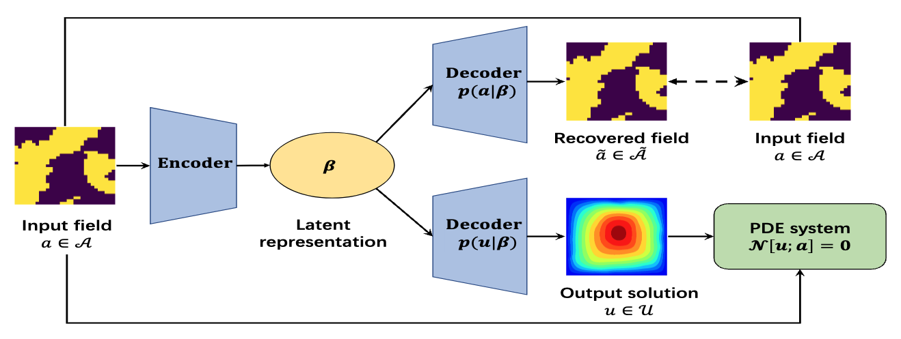
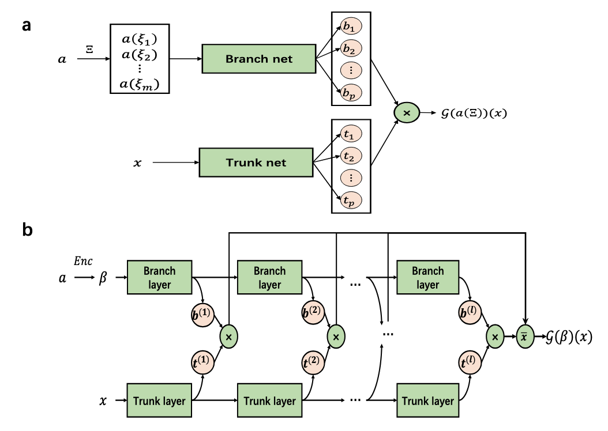

# Deep Generative Neural Operator 
The [DGenNO](https://arxiv.org/pdf/2502.06250) is a **physics-informed, probabilistic** framework for solving **parametric PDEs** and challenging **inverse problems**, especially with high-dimensional, **discontinuous inputs**, or **sparse, noisy observations**. Unlike traditional neural operators, DGenNO leverages a deep generative model with **low-dimensional latent variables** that jointly encode PDE inputs and outputs. DGenNO enforces physics constraints **without labeled data** through virtual observables and **weak-form residuals** based on compactly supported radial basis functions (CSRBFs), avoiding higher-order derivatives (saving computing efforts) and relaxing regularity requirements (efficient in dealing with irregular inputs). This enables:
-  Efficient use of **unlabeled data, i.e., input-output pairs**
-  Handling **discontinuous or discrete-valued inputs**
-  Efficient in solving **inverse problems with sparse, noisy observation** (observation position are totally free).
- **Robust generalization** to out-of-distribution cases
- Provides **probabilistic predictions with uncertainty quantification**

We also introduce **MultiONet**, a powerful extension of DeepONet that significantly improves the expressiveness of operator learning **without introducing new network architectures and many training parameters**.

### (1) The DGenNO framework (<span style="color:red;">without any labeled input-output training pairs</span>)
<p align="center">
  
</p>
<p align="center">
  <em>Figure 1: The Deep Generative Neural Operator (DGenNO) framework.</em>
</p>

### (2) DGenNO for inverse problems with <span style="color:red;">noisy, sparse observations</span>
<p align="center">
  
</p>
<p align="center">
  <em>Figure 2: Solving the inverse problem with DGenNO.</em>
</p>

### (3) The MultiONet architecture
<p align="center">
  
</p>
<p align="center">
  <em>Figure 3: a) DeepONet architecture vs. b) MultiONet architecture.</em>
</p>

## 📌 Benchmark Problems
We evaluate the DNO frameworks on the following PDEs:
#### 1. Burger’s Equation
Goal: Learn the operator mapping initial condition $a(x):=u(x,t=0)$ to the solution $u(x,t)$.

#### 2. Darcy’s Flow
Goal: Learn the mapping from the permeability field $a(x)$ to the pressure field $u(x)$.
We considered two cases: (1) Smooth $a(x)$ and (2) Piecewise-constant $a(x)$.

#### 3. Stokes Flow with a Cylindrical Obstacle
Goal: Learn the mapping from in-flow velocity ${\bf u}_0 = (a(x), 0)$ to the pressure field $u(x)$.

#### 4. Inverse Discontinuity Coefficient in Darcy’s Flow

We also consider the inverse problem of reconstructing the **piecewise-constant** permeability field $a(x)$ from **sparse, noisy** observations of $u$. This problem has important applications in subsurface modeling and medical imaging.

## 🔗 Data Availability
Training data and testing data can be downloaded from **[Google Drive](https://drive.google.com/drive/folders/1O1givx3qs90MvaLVmpXMKvmq57EtZrTF?usp=sharing)** (all trained forward and inverse models can also be downloaded here).

## Related Resources
The implementation of Deep Generative Neural Operator (DGenNO) and other popular deep neural operator (DNO) methods (e.g., DeepONet, FNO, PI-DeepONet, and PINO) can also be found on the Github repository: [https://github.com/yaohua32/Deep-Neural-Operators-for-PDEs](https://github.com/yaohua32/Deep-Neural-Operators-for-PDEs).

## 📖 Citation
```
@article{zang2025dgenno,
  title={DGenNO: a novel physics-aware neural operator for solving forward and inverse PDE problems based on deep, generative probabilistic modeling},
  author={Zang, Yaohua and Koutsourelakis, Phaedon-Stelios},
  journal={Journal of Computational Physics},
  volume={538},
  pages={114137},
  year={2025},
  publisher={Elsevier}
}
```

